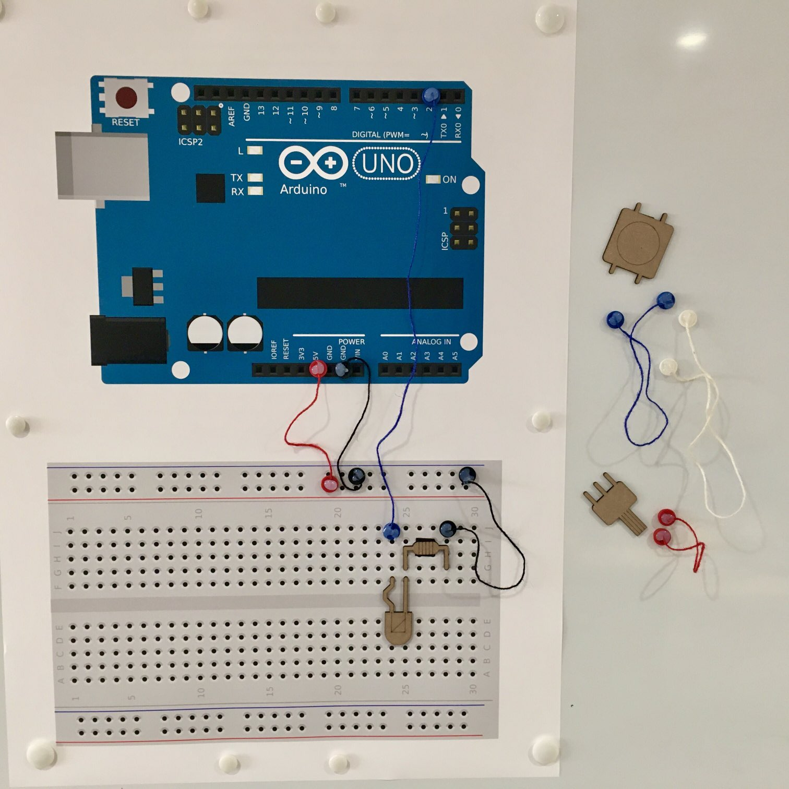

# Low tech educational Arduino workshop materials

This KISS setup allows you to give Arduino workshops with no-tech tools, on a whiteboard.

## What you need

* A1 poster (in this repo)
* Magnets in various colors  
    * Preferably less than 15mm in diameter
    * You want black, red and at least one other color magnets
* String in matching colors
* Hot glue gun & hot glue
* Lasercut components (in this repo)
* Magnetic stickers
* Whiteboard

## Instructions

* Print the A1 poster that has a big size Arduino and breaboard. The pitch, or distance between holes, is 15mm (it is 2.54mm in real life), so make sure the PDF is printed in the correct, original format.
* Lasercut the components (black lines are cuts, red lines are engravings). Again, make sure to cut them to the size so that leads are 15mm apart. Stick magnet stickers to the back of the components so you can place them on the whiteboard.
* Hot glue various lengths of string to the coloured magnets. Make sure some strings can reach from the top of the Arduino to the breadboard, but don't make them too long for visibility.
* Use this kit to help others learn about Arduino!
